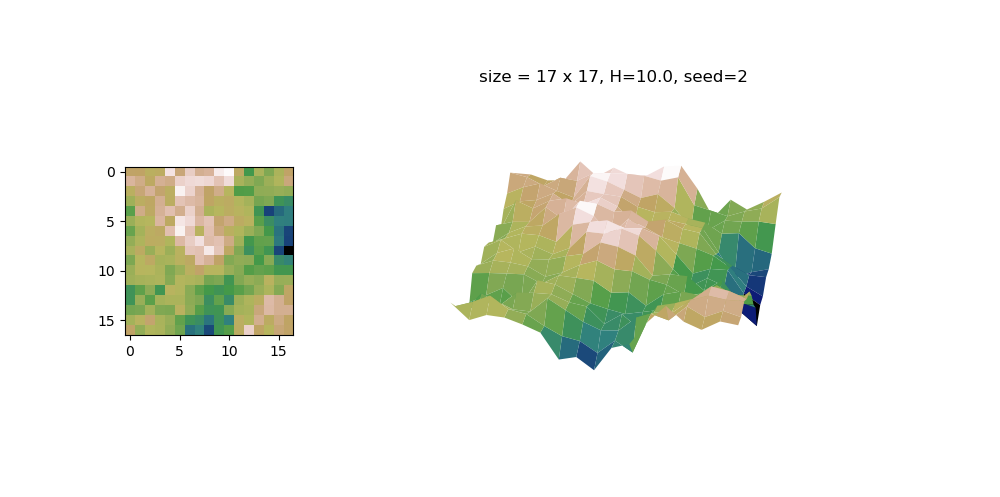
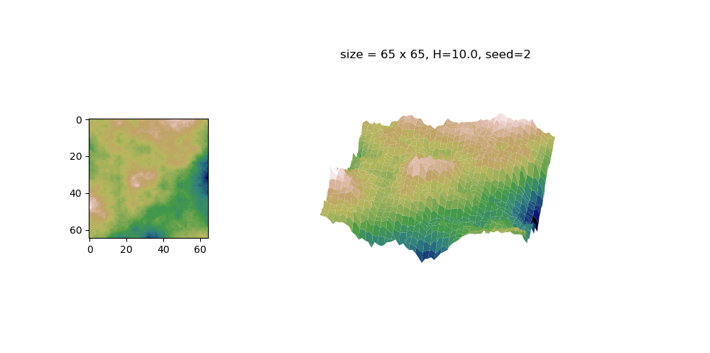
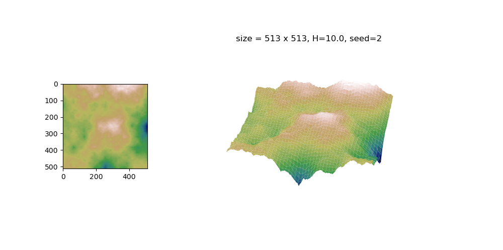
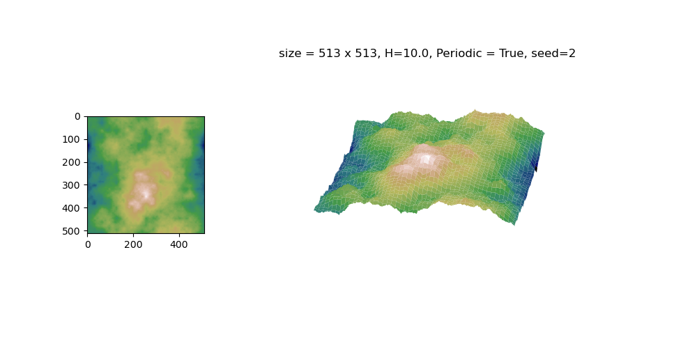

# fractal2d.py

フラクタル構造を持った地形を自動生成します。
wikipediaに掲載されている[ダイヤモンドアルゴリズム](https://en.wikipedia.org/wiki/Diamond-square_algorithm)を再帰関数を使って実装しました。

# DEMO1
main.py を実行したときのデモ
以下の fractal2d.py で生成した地形を鳥観図でスクロールさせています。

```bash
$ python main.py
```


# DEMO2
fractal2d.py を実行したときのデモ
詳しい使い方は下のUsage 参照
```bash
$ python fractal2d.py
```

1辺が、$2^n + 1$ ($n$は自然数)となる大きさの2次元配列を生成します。要素は高さに対応します。

size 17x17, H=10.0 Seed=2 で生成した場合





size 65x65, H=10.0 Seed=2 で生成した場合



size 513x513, H=10.0 Seed=2 で生成した場合


size 513x513, H=10.0 Seed=2 で周期境界条件で生成したとき
（上下左右がつながっている）



自己相似の性質があるので、配列サイズを大きくしても似たような地形となります。


# Requirement

* numpy
* matplotlib (デモ表示用)


# Usage of fractal2d

クローン後、ターミナルから、

```bash
$ python fractal2d.py
```

または、ターミナルから、
```bash
$ python fractal2d.py 5 10 1 1# [size_level] [height] [periodic] [seed]
```

または、pythonのコードで、
```python
import fractal2d 

size_level = 5 # 自然数 size = size_level**2 + 1 となる
height = 10.0 # 正の実数
seed=1        # 乱数のシード値
periodic=True # True / False 周期境界条件を入れるかどうか

ft = fractal2d.Fractal2d()
ff = ft.generate(size_level, height=height, seed=seed, pbc=periodic)
# ffが出力の2次元配列
```


# Note

size_level は大きくすると処理が重くなるので、7以上は1ずつ増やして試した方がよいです。

# Author

* まこっちノート
* itoshin3141592@gmail.com

